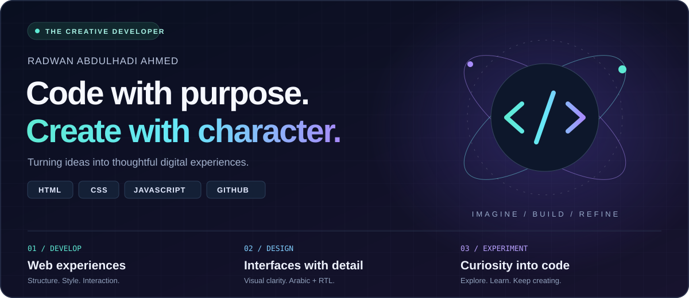

  

<b>Developer by curiosity. Creator by instinct.</b> 
I build practical projects across desktop tools, web interfaces, robotics, automation, data analysis, IoT, and fullstack experiments.

أحوّل الأفكار إلى مشاريع رقمية حقيقية: أدوات سطح مكتب، واجهات عربية، روبوتات، أتمتة، تحليل بيانات، وإنترنت الأشياء.

  <code>C#</code> · <code>WinUI 3</code> · <code>Python</code> · <code>C++</code> · <code>C</code> · <code>Arduino</code> · <code>MicroPython</code> · <code>ROS 2</code> · <code>JavaScript</code> · <code>TypeScript</code> · <code>PHP</code> · <code>Java</code> · <code>Kotlin</code> · <code>Go</code> · <code>Rust</code> · <code>SQL</code> · <code>PowerShell</code>

## Featured repositories

<table>
<tr>
<td width="50%" valign="top">
<h3>🤖 Robotics Language Lab</h3>

Multi-language robotics examples: embedded firmware, PID control, A* navigation, ROS-style configs, URDF, telemetry, dashboards, and diagnostics.

<code>Python</code> <code>C++</code> <code>C</code> <code>Arduino</code> <code>ROS 2</code>

<a href="https://github.com/rad03i2/robotics-language-lab"><b>Open repository →</b></a>
</td>
<td width="50%" valign="top">
<h3>🧠 AI Tools Lab</h3>

Local AI helper tools for prompt cleaning, extractive summaries, task templates, and a browser prompt playground.

<code>Python</code> <code>JavaScript</code> <code>JSON</code>

<a href="https://github.com/rad03i2/ai-tools-lab"><b>Open repository →</b></a>
</td>
</tr>
<tr>
<td width="50%" valign="top">
<h3>🖥️ Smart File Manager</h3>

Windows desktop project built with C# and WinUI 3 for batch renaming and duplicate-file detection using SHA-256 hashes.

<code>C#</code> <code>WinUI 3</code> <code>Desktop</code>

<a href="https://github.com/rad03i2/SmartFileManager"><b>Open repository →</b></a>
</td>
<td width="50%" valign="top">
<h3>⚙️ Desktop Automation Suite</h3>

Safe Windows automation samples using PowerShell, C#, and AutoHotkey for productivity workflows.

<code>PowerShell</code> <code>C#</code> <code>AutoHotkey</code>

<a href="https://github.com/rad03i2/desktop-automation-suite"><b>Open repository →</b></a>
</td>
</tr>
<tr>
<td width="50%" valign="top">
<h3>🛠️ Windows System Toolkit</h3>

Local Windows reporting and safe cleanup-preview scripts with C# models for disk snapshots.

<code>PowerShell</code> <code>C#</code> <code>Windows</code>

<a href="https://github.com/rad03i2/windows-system-toolkit"><b>Open repository →</b></a>
</td>
<td width="50%" valign="top">
<h3>🌐 Arabic UI Components</h3>

Responsive Arabic RTL components: dashboard cards, navigation, forms, and modern interface blocks.

<code>HTML</code> <code>CSS</code> <code>JavaScript</code>

<a href="https://github.com/rad03i2/arabic-ui-components"><b>Open repository →</b></a>
</td>
</tr>
<tr>
<td width="50%" valign="top">
<h3>📡 IoT Sensor Dashboard</h3>

Arduino sensor node, Node.js telemetry server, and browser dashboard for IoT readings.

<code>Arduino</code> <code>Node.js</code> <code>HTML</code>

<a href="https://github.com/rad03i2/iot-sensor-dashboard"><b>Open repository →</b></a>
</td>
<td width="50%" valign="top">
<h3>📊 Data Analysis Notebooks</h3>

CSV dataset, Python analysis workflow, and notebook-style reporting for environmental readings.

<code>Python</code> <code>CSV</code> <code>Data Analysis</code>

<a href="https://github.com/rad03i2/data-analysis-notebooks"><b>Open repository →</b></a>
</td>
</tr>
<tr>
<td width="50%" valign="top">
<h3>🔐 Web Security Lab</h3>

Defensive web security examples: safe output, password policy helper, and CSRF token demo.

<code>HTML</code> <code>JavaScript</code> <code>PHP</code>

<a href="https://github.com/rad03i2/web-security-lab"><b>Open repository →</b></a>
</td>
<td width="50%" valign="top">
<h3>📱 Mobile App Starter Kit</h3>

Android and Kivy starter examples for practicing mobile app structure and UI concepts.

<code>Kotlin</code> <code>XML</code> <code>Python</code>

<a href="https://github.com/rad03i2/mobile-app-starter-kit"><b>Open repository →</b></a>
</td>
</tr>
</table>

## More labs

- [Student Management System](https://github.com/rad03i2/student-management-system) — Java + SQL educational system.
- [File Processing Toolkit](https://github.com/rad03i2/file-processing-toolkit) — Python/C#/Bash file utilities.
- [C++ Algorithms Lab](https://github.com/rad03i2/cpp-algorithms-lab) — C++ algorithms and data structures.
- [Python Automation Hub](https://github.com/rad03i2/python-automation-hub) — local automation scripts.
- [Fullstack Mini Projects](https://github.com/rad03i2/fullstack-mini-projects) — PHP/JS/SQL mini application.
- [Developer Portfolio](https://github.com/rad03i2/developer-portfolio) — responsive personal portfolio site.

## Current focus

- Building useful Windows desktop tools.
- Improving Arabic-friendly user interfaces.
- Practicing robotics, IoT, automation, and data-analysis projects.
- Turning ideas into real, organized repositories.

IDEA → DESIGN → CODE → REFINE <b>Always curious. Always creating.</b>

